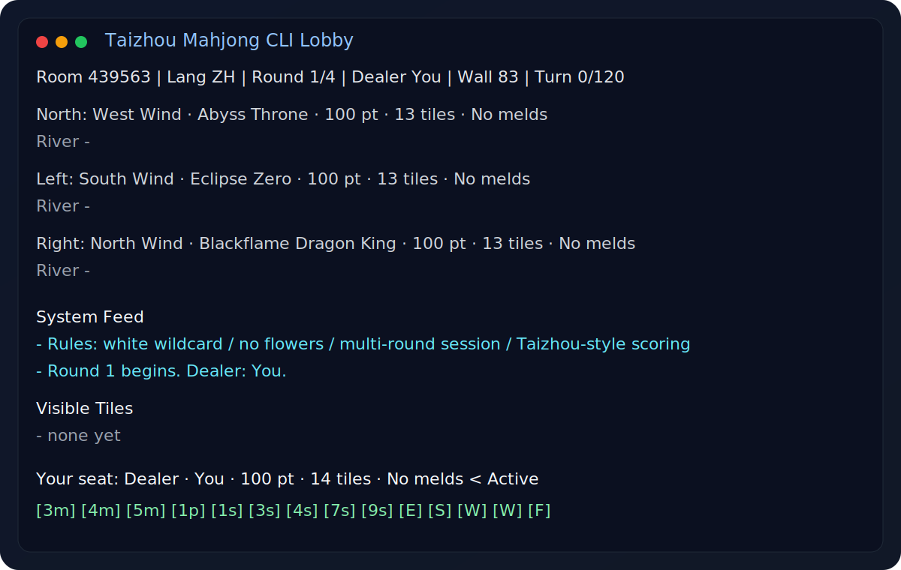

# Taizhou Mahjong CLI Skill

An English-first GitHub home for a text-mode Taizhou Mahjong prototype and a reusable AI skill package.

This repository combines two things:

- A zero-dependency CLI Mahjong lobby and table simulator
- A portable skill package that can help AI assistants review hands, suggest discards, explain waits, and coach decision-making



## Features

- Taizhou-style Mahjong prototype with no flowers
- White Dragon as a wildcard in win evaluation
- White Dragon does not participate in chi, pung, or kong claims
- Multi-round session flow with dealer rotation and point tracking
- Chinese and English UI
- ASCII / box-drawing tile rendering for terminal play
- Visible-tile tracking for discards and exposed melds
- Ting analysis and trustee mode during live play
- Deterministic hand review script for coaching and study
- Skill adapters for Codex, Claude-style, and OpenClaw-style assistants

## Run The CLI

```bash
python3 main.py
```

Auto demo:

```bash
python3 main.py --demo --no-delay
```

## Review A Hand

Use the coaching helper when you want discard advice or ting analysis:

```bash
python3 skills/mahjong/scripts/review_hand.py \
  --hand "1m 2m 2s 3s 4s 6m 6m 6p 7p 8m 8p 9m 9s 白板" \
  --visible "1m 7m 9s 东风"
```

Example output:

```text
Hand: [1Wan] [2Wan] ...
Suggestion: discard [9Bam] first
Ready-hand discard options:
1. Discard [9Bam] -> wait on [7Wan] | about 3 live
```

## Skill Layout

- [skills/mahjong/SKILL.md](skills/mahjong/SKILL.md): main skill entry for Codex-style systems
- [skills/mahjong/references/taizhou_rules.md](skills/mahjong/references/taizhou_rules.md): rules and scoring assumptions
- [skills/mahjong/references/coaching.md](skills/mahjong/references/coaching.md): coaching workflow
- [skills/mahjong/scripts/mahjong_cli.py](skills/mahjong/scripts/mahjong_cli.py): CLI game loop
- [skills/mahjong/scripts/review_hand.py](skills/mahjong/scripts/review_hand.py): hand review helper
- [skills/mahjong/agents/openai.yaml](skills/mahjong/agents/openai.yaml): OpenAI/Codex metadata
- [skills/mahjong/agents/claude.md](skills/mahjong/agents/claude.md): Claude adapter notes
- [skills/mahjong/agents/openclaw.md](skills/mahjong/agents/openclaw.md): OpenClaw adapter notes

## Using It With AI Assistants

### Codex / OpenAI-style skills

Point the assistant at [skills/mahjong/SKILL.md](skills/mahjong/SKILL.md), or copy the entire `skills/mahjong/` folder into your skills directory.

### Claude-style workflows

Use [skills/mahjong/agents/claude.md](skills/mahjong/agents/claude.md) as the adapter prompt and keep the rest of the skill folder alongside it.

### OpenClaw-style workflows

Use [skills/mahjong/agents/openclaw.md](skills/mahjong/agents/openclaw.md) as the adapter prompt and keep the rest of the skill folder alongside it.

## Why This Works Well As A Skill

This is a good fit for an AI skill because the assistant can do more than run the game:

- review a hand after a bad turn
- compare discard candidates
- explain why a wider wait is better
- estimate live tiles from visible information
- help build stronger shape and efficiency habits

That makes it useful as both a playable toy and a training tool.

## Current Scope

The scoring and rules are intentionally Taizhou-flavored rather than a full official local ruleset. It is designed for repeatable CLI play and coaching, not for strict tournament accuracy.

## Version

Current release target: `v0.1.0`
